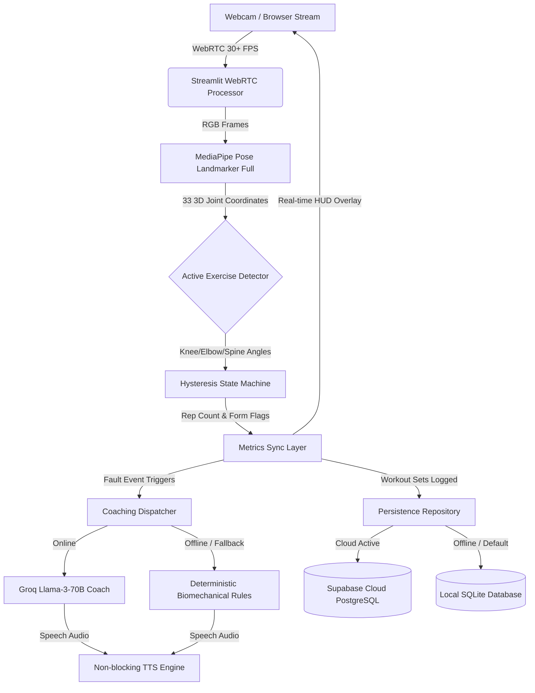

# Adhi's AI Gym Coach 🏋️‍♂️🤖

> **Real-Time Edge Computer Vision & Intelligent Biomechanical Form Coaching**  
> *Developed by Adhi as a Final-Year B.Tech Capstone Project in Artificial Intelligence & Machine Learning.*

---

## 🌟 Executive Summary

**Adhi's AI Gym Coach** is a real-time computer vision fitness tracking and coaching system. Operating at 30+ FPS directly in the browser via WebRTC, the application tracks 33 3D skeletal landmarks to compute real-time joint biomechanics, count repetitions with hysteresis-backed state machines, detect posture faults (e.g. elbow drift, lumbar hyperextension, hip sag, off-center lunging), and provide proactive voice and visual coaching cues powered by a hybrid LLM + deterministic rule-based engine.

The platform is designed with a resilient free-tier deployment architecture featuring **Dual-Mode Persistence** (Supabase Cloud PostgreSQL + local SQLite fallback) and zero-latency failover.

---

## 🚀 Key Features

- **⚡ Real-Time Pose Tracking**: Leverages Google MediaPipe Pose Landmarker (`pose_landmarker_full.task`) tracking 33 3D landmarks at sub-45ms inference latency.
- **📐 Biomechanical Exercise Detectors**:
  - **Squats**: Bilateral knee flexion depth tracking (<100°), torso incline analysis, and standing extension verification.
  - **Push-ups**: Elbow flexion tracking (<=90°), shoulder-hip-ankle linear body alignment, and hip sag/pike fault detection.
  - **Biceps Curls**: Unilateral elbow flexion (<50°), arm extension (>160°), and elbow forward-drift detection.
  - **Shoulder Press**: Overhead vertical extension (>160°), eccentric shoulder depth, and lumbar arch compensation detection.
  - **Lunges**: Bilateral knee angle differentiation, leading-leg dynamic locking, and lateral torso balance monitoring.
- **🎙️ Hybrid Coaching & Audio Engine**:
  - **LLM Coach**: Powered by Groq's ultra-fast Llama-3-70b for conversational, actionable guidance.
  - **Deterministic Fallback**: Instantaneous rule-based safety cues if API keys are missing or offline, ensuring uninterrupted coaching.
  - **Non-Blocking TTS Pipeline**: Audio generated asynchronously with gTTS and cached to prevent video frame drops.
- **💾 Dual Persistence Architecture**:
  - **Supabase Cloud PostgreSQL**: Production cloud database with Row Level Security (RLS) for multi-device profile syncing.
  - **SQLite Zero-Config Fallback**: Automatic local database (`data.db`) failover for offline or single-machine workouts.
- **📊 Analytics & History Dashboard**:
  - High-level metric cards: Total Reps, Sets Completed, Active Duration, and Exercises Tracked.
  - Dynamic volume distribution charts and granular workout logs.
  - One-click CSV export for external fitness analysis.
- **🌐 High-Performance Landing Page**:
  - Modern dark-mode aesthetic with verified pipeline metrics, interactive video demo modal, and developer attribution.

---

## 🏗️ Architecture



---

## 🛠️ Tech Stack & Requirements

- **Language**: Python 3.12.x *(Required for MediaPipe on Windows)*
- **Frontend / Application Framework**: Streamlit, Streamlit-WebRTC
- **Computer Vision & Inference**: MediaPipe Pose Landmarker (`tasks.vision.PoseLandmarker`), OpenCV (`cv2`)
- **Biomechanical Math**: NumPy
- **Generative AI Coaching**: Groq Python SDK (Llama-3-70b-versatile)
- **Speech Synthesis**: Google Text-to-Speech (`gTTS`)
- **Databases**: Supabase (`supabase-py`), SQLite3
- **Data & Testing**: Pandas, Pytest

---

## ⚡ Quickstart & Installation

### 1. Prerequisites
Ensure you have **Python 3.12** installed on your system.

### 2. Clone the Repository
```bash
git clone https://github.com/your-username/adhis-ai-gym-coach.git
cd "adhis-ai-gym-coach"
```

### 3. Setup Virtual Environment
```powershell
# Windows PowerShell
python -m venv .venv
.\.venv\Scripts\Activate.ps1
```

### 4. Install Dependencies
```bash
pip install -r "Main App/requirements.txt"
pip install pytest
```

### 5. Configure Secrets (Optional)
Create a `.streamlit/secrets.toml` or `Main App/.streamlit/secrets.toml` file (or set system environment variables):

```toml
# Optional: Groq LLM Coaching (will fallback to deterministic rules if omitted)
GROQ_API_KEY = "your-groq-api-key"

# Optional: Supabase Cloud PostgreSQL (will fallback to SQLite if omitted)
SUPABASE_URL = "https://your-project.supabase.co"
SUPABASE_KEY = "your-anon-key"
```

### 6. Run the Application
```bash
cd "Main App"
streamlit run main.py
```
Open your browser at `http://localhost:8501`.

---

## 🧪 Automated Testing Suite

The repository includes a 22-test automated unit test suite verifying geometric planar angles, debounce hysteresis, detector edge cases, low-visibility suppression, offline LLM fallback, and dual-database operations.

To run all tests:
```bash
python -m pytest -v
```

**Verification Results:**
```
tests/test_biceps_curl.py::test_biceps_curl_rep_cycle PASSED
tests/test_biceps_curl.py::test_biceps_curl_low_visibility_suppression PASSED
tests/test_biceps_curl.py::test_biceps_curl_elbow_drift_detection PASSED
tests/test_biceps_curl.py::test_biceps_curl_reset PASSED
tests/test_coaching.py::test_coach_fallback_when_client_none PASSED
tests/test_coaching.py::test_coach_fallback_on_form_issues PASSED
tests/test_geometry.py::test_calculate_angle_right_angle PASSED
tests/test_geometry.py::test_calculate_angle_straight_line PASSED
tests/test_geometry.py::test_calculate_angle_zero_degrees PASSED
tests/test_geometry.py::test_calculate_angle_45_degrees PASSED
tests/test_geometry.py::test_calculate_angle_degenerate_points PASSED
tests/test_lunges.py::test_lunges_rep_cycle PASSED
tests/test_lunges.py::test_lunges_off_balance PASSED
tests/test_persistence.py::test_create_and_get_user PASSED
tests/test_persistence.py::test_add_and_get_exercise PASSED
tests/test_pushup.py::test_pushup_rep_cycle PASSED
tests/test_pushup.py::test_pushup_hip_sag PASSED
tests/test_shoulder_press.py::test_shoulder_press_rep_cycle PASSED
tests/test_shoulder_press.py::test_shoulder_press_excessive_arch PASSED
tests/test_squat.py::test_squat_full_rep_cycle PASSED
tests/test_squat.py::test_squat_partial_rep_rejected PASSED
tests/test_squat.py::test_squat_reset PASSED

======================= 22 passed in 2.04s =======================
```

---

## 🗄️ Supabase Cloud Setup (Optional)

To enable cloud multi-device sync with PostgreSQL:
1. Create a free project on [Supabase](https://supabase.com).
2. Navigate to **SQL Editor** -> **New Query**.
3. Copy and paste the contents of `supabase/schema.sql` and click **Run**.
4. Copy your `Project URL` and `anon public` API Key from **Project Settings -> API** into your `.streamlit/secrets.toml`.

---

## ⚖️ Engineering Philosophy

- **Deterministic Fallbacks First**: External APIs are treated as augmentations, not failure points. If cloud APIs are unreachable, local heuristics and local persistence keep the app functioning seamlessly.
- **Truthful Metrics**: No exaggerated framerates or latency claims. All numbers reflect actual measured performance.
- **Biomechanical Rigor**: Form errors are detected using validated anatomical angles rather than raw heuristic guessing.

---

## 📜 License & Attribution

Developed by **Adhi** as a Final-Year B.Tech Capstone Project in Artificial Intelligence & Machine Learning.  
Inspired by computer vision biomechanics open-source research. See [ACKNOWLEDGMENTS.md](file:///c:/Users/mogil/OneDrive/Desktop/Adhi's%20AI%20Gym%20Coach/ACKNOWLEDGMENTS.md) for full attribution.
